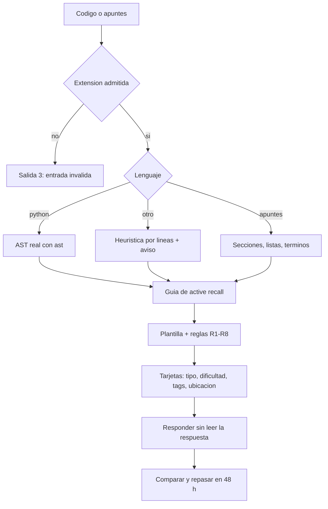
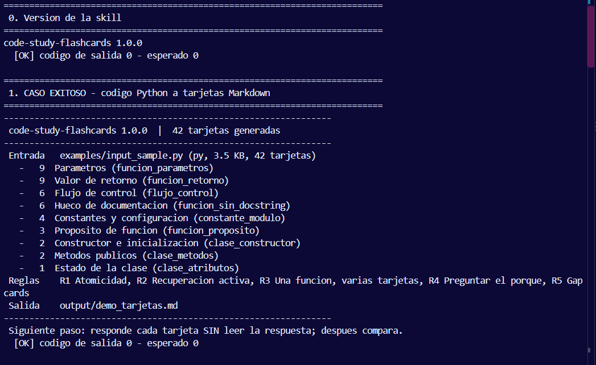
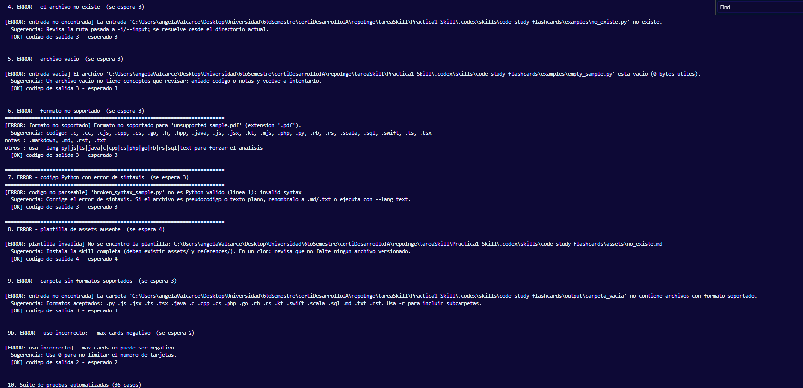
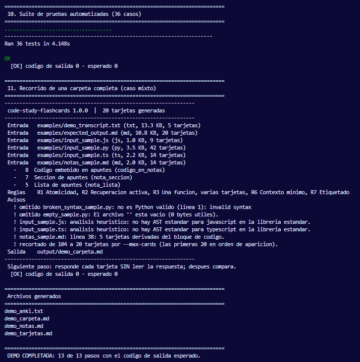
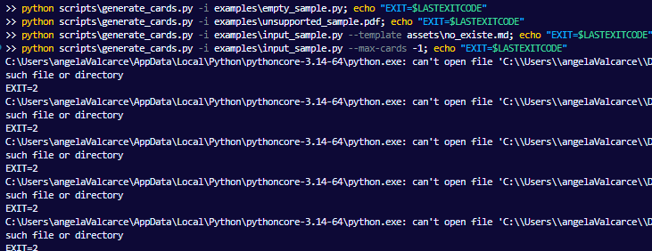
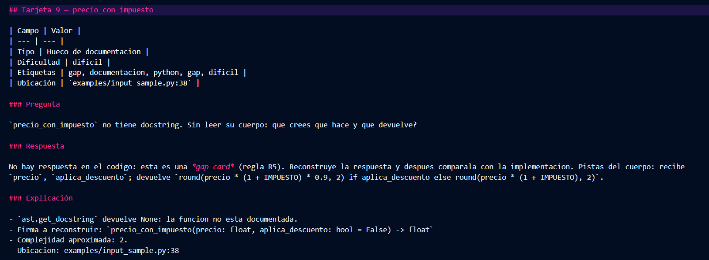
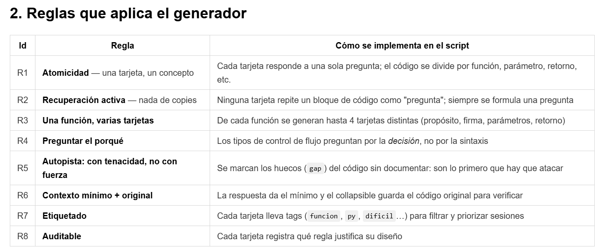

# Practica1-Skill

**code-study-flashcards** - skill que convierte codigo fuente o apuntes de estudio en
tarjetas de **repaso activo** (Active Recall) en Markdown o en TSV para Anki.

La idea es simple: releer no consolida memoria. Si tapas el codigo y reconstruyes la
firma desde la memoria de trabajo, si. Esta skill automatiza esa pregunta y respuesta.

```
codigo / apuntes  ->  tarjetas  ->  responder sin mirar  ->  comparar  ->  repasar en 48 h
```

## Instalacion

Requiere **Python 3.9+**. Cero dependencias: solo libreria estandar, sin red y sin API keys.

```bash
git clone https://github.com/Annvies/Practica1-Skill.git
cd Practica1-Skill
```

La skill vive en `.codex/skills/code-study-flashcards/` y se usa desde ahi:

```bash
cd .codex/skills/code-study-flashcards
python scripts/generate_cards.py -i examples/input_sample.py -o output/tarjetas.md
```

### Instalarla en un agente de codigo

Para que un agente la use por su cuenta, la carpeta de la skill debe estar en el
directorio de skills del agente. En Windows y Linux es la misma ruta de usuario:

| Agente | Ruta de skills |
| --- | --- |
| Codex CLI | `~/.codex/skills/` |
| OpenCode y agentes compatibles | `~/.agents/skills/` |
| Claude Code | `~/.claude/skills/` |

```bash
# Linux, macOS o Git Bash
cp -r .codex/skills/code-study-flashcards ~/.codex/skills/
mkdir -p ~/.codex/skills/code-study-flashcards/output

# Windows PowerShell
Copy-Item -Recurse .codex\skills\code-study-flashcards "$env:USERPROFILE\.codex\skills\"
New-Item -ItemType Directory -Force "$env:USERPROFILE\.codex\skills\code-study-flashcards\output"
```

Despues de instalarla, la peticion en el agente es en lenguaje natural: *"genera
tarjetas de repaso activo para `src/inventory`"*. El agente lee `SKILL.md`, invoca el
script con `-r` y te devuelve el archivo Markdown.

`output/` queda ignorado por git a proposito: las tarjetas son material de estudio
personal, no parte del repositorio.

## Flujo



## Uso en una linea

```bash
# Un archivo de codigo
python scripts/generate_cards.py -i mi_modulo.py -o output/mi_modulo.md

# Apuntes, con 10 tarjetas para una sesion corta
python scripts/generate_cards.py -i notas/tema3.md -o output/tema3.md --max-cards 10

# Importar en Anki (TSV)
python scripts/generate_cards.py -i mi_modulo.py --format anki -o output/mi_modulo.txt

# Una carpeta entera, con subcarpetas
python scripts/generate_cards.py -i src/ -r --max-cards 40
```

## Demostracion

```bash
scripts\demo.bat      # Windows
bash scripts/demo.sh   # Linux, macOS o Git Bash
```

Ejecuta 13 pasos: casos exitosos (Python, apuntes, Anki, carpeta mixta) y la matriz
completa de errores, comprobando el codigo de salida de cada uno.

```
 DEMO COMPLETADA: 13 de 13 pasos con el codigo de salida esperado.
```

## Pruebas

```bash
python -m unittest discover -s tests
```

```
Ran 40 tests in 5.7s

OK
```

Que cubren los 40 casos:

| Grupo | Que verifica |
| --- | --- |
| Generacion | Python, apuntes, JavaScript y TypeScript producen tarjetas; metadatos y encabezados correctos. |
| Filtros | `-r` recorre carpetas e ignora `generated/`, `.d.ts`, `node_modules/`, `dist/` y binarios. |
| Heuristica TS | `static readonly`, `constructor` con inyeccion, metodos `async` con tipo de retorno, firmas partidas en varias lineas y metodos `private`. |
| Gap cards | Una funcion publica sin docstring genera hueco de documentacion. |
| Anki | TSV real: cabecera, campos separados por tabulador, sin formato Markdown. |
| Contratos | Los cinco codigos de salida (0, 1, 2, 3, 4) y la carpeta vacia. |
| Determinismo | Dos corridas seguidas producen archivos identicos byte a byte. |
| Assets | plantilla o guia faltante o invalida abortan con codigo 4. |

## Evidencia visual

Capturas de una corrida real de `scripts\demo.bat` (13 de 13 pasos con el codigo de
salida esperado). Clic en cualquier imagen para verla a tamano completo.

### 1. Caso exitoso: el comando, las 42 tarjetas generadas y el codigo de salida 0

[](.codex/skills/code-study-flashcards/docs/capturas/01-demo-caso-exitoso.png)

### 2. Matriz de errores: seis entradas invalidas, cada una con su codigo verificado

[](.codex/skills/code-study-flashcards/docs/capturas/02-demo-matriz-de-errores.png)

### 3. Suite de pruebas (40 casos) y cierre de la demo con 13 de 13

[](.codex/skills/code-study-flashcards/docs/capturas/03-demo-tests-y-cierre.png)

### 4. Errores ejecutados a mano, con `EXIT=` explicito en pantalla

[](.codex/skills/code-study-flashcards/docs/capturas/04-errores-con-codigo-de-salida.png)

### 5. Una tarjeta generada: las cuatro secciones de `assets/flashcard_template.md`

[](.codex/skills/code-study-flashcards/docs/capturas/05-tarjeta-generada.png)

### 6. Las reglas R1-R8 que gobiernan al generador

[](.codex/skills/code-study-flashcards/docs/capturas/06-guia-active-recall.png)

## Proyecto real: pids_final_taller

La skill se valido sobre un proyecto de verdad, no solo sobre los ejemplos del
repositorio. `pids_final_taller` es un sistema de gestion de inventario y almacen
(NestJS + Prisma + React).

> Esto es **validacion documentada**, no parte de la demo en vivo. La demostracion
> que se ejecuta en la presentacion es `scripts\demo.bat`, que es autocontenida y
> no depende de ningun proyecto externo. Estas dos corridas son la evidencia de que
> la skill tambien funciona sobre codigo real, y los comandos estan aqui para
> que cualquiera pueda repetirlas.

**1. Apuntes de integracion** (`ai-context/backlog/E3-gestion-de-inventario-y-almacen.md`):

```bash
python scripts/generate_cards.py \
  -i "C:/.../pids_final_taller/ai-context/backlog/E3-gestion-de-inventario-y-almacen.md" \
  -o output/pids_notas.md
```

```
37 tarjetas generadas
  -  15  Seccion de apuntes
  -   9  Codigo en apuntes
  -   7  Lista de apuntes
  -   6  Termino y definicion
```

**2. Codigo del modulo de inventario** (`taller_back/src/modules/inventory`):

```bash
python scripts/generate_cards.py \
  -i "C:/.../pids_final_taller/taller_back/src/modules/inventory" \
  -o output/pids_codigo.md
```

```
23 tarjetas generadas
  -  17  Proposito de funcion
  -   4  Estado de la clase
  -   1  Constantes y configuracion
  -   1  Flujo de control
```

Lo que se aprendo probando en un proyecto real, y que los ejemplos pequenos no
mostraban:

- **El filtro de codigo generado importa.** El proyecto tiene Prisma en
  `src/generated/` y declaraciones `.d.ts` de TypeScript. Sin filtrarlas, el
  material de estudio se llenaba de ruido generado; con el filtro, 513 archivos
  recolectables de 541 candidatos.
- **La heuristica tiene que entender las convenciones del ecosistema.** El servicio
  `inventory.service.ts` esta escrito con tipos de retorno `Promise<...>`,
  `constructor(private readonly repository: ...)`, constantes `static readonly` y
  firmas partidas en varias lineas. Un patron ingenuo del tipo `nombre(args) {`
  devolvia **2 tarjetas por un archivo de 139 lineas**; tras soportar las firmas de
  TypeScript devuelve **23 tarjetas** y detecta los 9 metodos del servicio.
- **El aviso de heuristica es informacion, no ruido.** En un proyecto TS cada
  archivo reporta que no hay AST disponible, y eso queda escrito tambien dentro de
  la tarjeta para que el estudiante no confunda una inferencia con un hecho.

## Que genera

Cada tarjeta trae tipo, dificultad, tags, ubicacion, pregunta, respuesta minima,
explicacion, un fragmento de codigo y el codigo original plegado en `<details>`.
Ademas registra en un comentario HTML que regla pedagogica justifica su diseno
(R8, auditable), para que siempre se pueda responder *"¿por que esta pregunta?"*.

Tipos de tarjeta: proposito de funcion, parametros, valor de retorno, flujo de control,
constante de modulo, constructor, atributos de clase, metodos publicos, **hueco de
documentacion** (gap card), seccion y lista de apuntes, y codigo embebido en notas.

Ejemplo real de una tarjeta:

```markdown
## Tarjeta 5 - resumen_inventario

| Campo | Valor |
| --- | --- |
| Tipo | Proposito de funcion |
| Dificultad | media |
| Etiquetas | funcion, proposito, python, media |
| Ubicación | `examples/input_sample.py:20` |

### Pregunta

Sin mirar el codigo: que hace `resumen_inventario` y que devuelve? Respondelo con tus palabras antes de continuar.

### Respuesta

Devuelve un conteo de productos por categoria, limitado a `limite` entradas.
Firma: `resumen_inventario(productos: List[Dict], limite: int = 10) -> Dict[str, int]`

### Explicación

- Firma completa: `resumen_inventario(productos: List[Dict], limite: int = 10) -> Dict[str, int]`
- Devuelve 1 forma(s) distinta(s): `dict(ordenadas[:limite])`
- La docstring tiene 8 lineas; la respuesta usa solo la frase resumen.
- Complejidad aproximada: 3 (1 + ramas + returns).
- Ubicacion: examples/input_sample.py:20

```python
def resumen_inventario(productos: List[Dict], limite: int = 10) -> Dict[str, int]:
    conteo: Dict[str, int] = {}
    for producto in productos:
        categoria = producto.get("categoria", "sin categoria").lower().strip()
        conteo[categoria] = conteo.get(categoria, 0) + 1
    ordenadas = sorted(conteo.items(), key=lambda par: (-par[1], par[0]))
    return dict(ordenadas[:limite])
```

<details>
<summary>Ver código original completo</summary>

La tarjeta incluye el codigo original completo de la funcion, plegado para
verificar **despues** de responder, no antes.

</details>

<!--
Tarjeta 5 de 42 | tipo=Proposito de funcion | icono=funcion | dificultad=media | tags=funcion, proposito, python, media
Reglas aplicadas (references/active_recall_guide.md): R1, R2, R4
Regla principal: R2 Recuperacion activa
-->
```

## Formatos soportados

| Tipo | Extensiones | Analisis |
| --- | --- | --- |
| Python | `.py` | AST real (`ast`): firmas, docstrings, retornos, ramas, clases. |
| Otros lenguajes | `.js .jsx .mjs .cjs .ts .tsx .java .c .h .cc .cpp .hpp .cs .php .go .rb .rs .kt .swift .scala .sql` | Heuristico por lineas. |
| Apuntes | `.md .markdown .txt .rst` | Secciones, listas, terminos y bloques de codigo. |

Un `.pdf` u otro binario se rechaza con una explicacion: la skill no extrae texto de
binarios. Si el archivo es pseudocodigo, renombralo a `.md` o usa `--lang text`.

## Codigos de salida

| Codigo | Significado |
| --- | --- |
| `0` | Generacion correcta. |
| `2` | Uso incorrecto (falta `-i`, `--max-cards -1`). |
| `3` | Problema de entrada: no existe, vacia, ilegible, extension no valida, error de sintaxis, o carpeta sin archivos soportados. |
| `4` | Faltan o son invalidos `assets/flashcard_template.md` o `references/active_recall_guide.md`. |
| `1` | Error inesperado. |

En una carpeta, un archivo problematico no aborta la corrida: se omite con un aviso y
el resto se procesa.

## Como se construyo

El orden importa: primero la pedagogia, despues el formato, luego el codigo.

1. **La guia primero.** Antes de escribir una linea de Python se escribieron las 8
   reglas de repaso activo en `references/active_recall_guide.md`, con la taxonomia
   de tarjetas y la escala de dificultad. La guia es la fuente de verdad y el
   generador la lee en tiempo de ejecucion.
2. **La plantilla define la forma.** `assets/flashcard_template.md` fijo el
   esqueleto de cada tarjeta. El generador solo rellena marcadores, nunca decide la
   estructura, asi que cambiar el formato es editar la plantilla.
3. **El nucleo se separo del CLI.** `flashcards_core.py` (tarjeta, guia, plantilla,
   carga de assets) quedo independiente de `generate_cards.py` (argumentos, recursion,
   salida, codigos de error) y de `flashcards_extract.py` (los extractores). Eso
   permite probar el nucleo sin lanzar el programa.
4. **Un extractor por capacidad, no por lenguaje.** En vez de un `if` por lenguaje,
   cada extractor declara que sabe hacer: el de Python usa `ast`; el de apuntes
   entiende secciones, listas, terminos en negrita y bloques de codigo; el
   heuristico reconoce firmas por forma de linea.
5. **Los errores son codigos, no texto.** Se definio un contrato de cinco codigos de
   salida y cada excepcion de dominio los respeta. Un archivo malo en una carpeta no
   aborta la corrida: se omite con aviso.
6. **Las pruebas se escribieron con la funcionalidad.** Hoy son 40 casos, entre ellos
   un test por codigo de salida, la comparacion de determinismo byte a byte y el
   filtro de codigo generado.
7. **La prueba de fuego fue el proyecto real.** Ejecutarla en `pids_final_taller`
   destapo lo que los ejemplos de 1 KB no muestran: el filtro de Prisma generado y
   las convenciones de NestJS. El extractor heuristico se corrigio ahi, no en teoria.

## FAQ

**¿Necesito instalar algo mas?**
No. Python 3.9+ y nada mas: sin `pip install`, sin red, sin API keys. Anki es
opcional; el formato principal es Markdown.

**¿Puedo usarla sin el agente de codigo?**
Si. Es un script de Python. El agente solo lee `SKILL.md` y lo invoca; el
material de estudio no depende de el.

**¿Como se evita que las tarjetas sean trivialmente copiables?**
Por la regla de recuperacion activa: la pregunta pide reconstruir la firma o la
decision *sin mirar el codigo*, y la respuesta va en la seccion siguiente. El
fragmento de codigo va plegado para poder verificarse despues, no antes.

**¿Que pasa si mi codigo esta en un lenguaje que no soporta?**
Se procesa con el extractor heuristico y la tarjeta lo declara. Si tu archivo es
pseudocodigo, renombralo a `.md` o usa `--lang text`.

**¿Por que una funcion sin docstring produce una "gap card"?**
Porque la ausencia de documentacion tambien es material de estudio: la tarjeta
pregunta que hace la funcion y por que no hay nadie que lo documente.

**¿Como importo las tarjetas en Anki?**
`--format anki` genera un TSV que se importa en *Archivo > Importar* con el tipo
"texto separado por tabuladores". En el dialogo solo hay que confirmar el mapeo:
columna 1 al campo Anverso, columna 2 al campo Reverso. Las etiquetas de la
columna 3 ya se aplican solas. Si pasas `--anki-notetype` y `--anki-deck`, el
tipo de nota y la baraja tambien vienen ya puestos.

El export deliberadamente **no** lleva una linea `#columns:`. Segun el manual de
Anki ese header solo "muestra los nombres dados al importar": no asigna campos.
Con el, el importador mapeaba la columna 1 y descartaba la 2 en silencio.
Descubrimos ese bug importando 15 notas que llegaron con el Reverso vacio, y hay
un test en `tests/` que lo evita. El reverso se genera en HTML, con `<br>` entre
respuesta y explicacion y el codigo escapado.

**¿El orden de las tarjetas es estable entre ejecuciones?**
Si. No hay aleatoriedad ni marcas de tiempo variables: la misma entrada produce el
mismo archivo. Por eso los tests pueden comparar salidas completas.

**¿Puedo cambiar el formato de salida?**
Editando `assets/flashcard_template.md`. El generador rellena marcadores, no
concatena texto.


## Decisiones de diseño

- **La guia gobierna al generador.** `references/active_recall_guide.md` contiene un
  bloque JSON delimitado por `active-recall-rules:start` / `active-recall-rules:end` con
  la taxonomia de tarjetas, los patrones de pregunta y la escala de dificultad. El script
  lo lee en tiempo de ejecucion y **aborta con codigo 4** si falta o es invalido, en vez
  de inventar reglas. La guia es codigo, no decoracion.
- **La plantilla se rellena, no se concatena.** `assets/flashcard_template.md` define el
  frontmatter y el esqueleto de cada tarjeta; el generador completa marcadores. Cambiar el
  formato de salida es editar la plantilla.
- **Trazabilidad del marcador.** En `.md` el archivo lleva `origen: "archivo:linea"` y
  `fecha`, de modo que se puede volver al punto exacto del material de origen.
- **Determinismo.** La misma entrada produce siempre el mismo archivo: sin aleatoriedad, sin
  marcas de tiempo variables. Es la unica forma de que `tests/` pueda comparar salidas.
- **Sin dependencias.** Nada de `pip install`. Un `.py` de 3 scripts corre en cualquier
  Python 3.9+, lo que importa en un entorno de evaluacion.
- **Python con AST, el resto con heuristica honesta.** No se simula un parser que no existe:
  el analizador heuristico lo declara en un aviso y en la tarjeta, para no hacer creer al
  estudiante que el analisis es tan preciso como el de Python.

## Estructura

```
Practica1-Skill/
├── README.md
├── LICENSE
├── .gitignore
└── .codex/skills/code-study-flashcards/
    ├── SKILL.md
    ├── assets/flashcard_template.md
    ├── references/active_recall_guide.md
    ├── scripts/
    │   ├── generate_cards.py
    │   ├── flashcards_core.py
    │   ├── flashcards_extract.py
    │   ├── demo.bat
    │   └── demo.sh
    ├── examples/
    │   ├── input_sample.py        # ejemplo con AST real (42 tarjetas)
    │   ├── input_sample.ts        # servicio NestJS para la heuristica (14 tarjetas)
    │   ├── input_sample.js
    │   ├── notas_sample.md
    │   ├── expected_output.md
    │   └── demo_transcript.txt    # salida literal de la demo, con rutas saneadas
    ├── docs/capturas/             # 01 a 06, evidencia de la presentacion
    └── tests/test_generate_cards.py
```

## Documentacion

- `SKILL.md` - cuando usarla, opciones, manejo de errores, flujo recomendado.
- `references/active_recall_guide.md` - las 8 reglas, por que importan y el JSON de configuracion.
- `examples/expected_output.md` - salida real de referencia: resumen, encabezado, una
  tarjeta completa, indice de las 42 tarjetas, export a Anki y mensajes de error.
- `examples/demo_transcript.txt` - transcripcion literal de los 13 pasos de la demo y de
  las dos corridas sobre `pids_final_taller`.
- `docs/capturas/` - las seis capturas de la presentacion, embebidas mas arriba en
  "Evidencia visual": `01-demo-caso-exitoso.png`, `02-demo-matriz-de-errores.png`,
  `03-demo-tests-y-cierre.png`, `04-errores-con-codigo-de-salida.png`,
  `05-tarjeta-generada.png`, `06-guia-active-recall.png`.

## Limitaciones conocidas

- Sin AST para JavaScript, TypeScript y demas: la deteccion de funciones, clases y
  constantes es por forma de linea. En un servicio NestJS funcionan las firmas con
  modificadores, tipos de retorno y saltos de linea, pero no se resuelven
  Property decorators ni herencias.
- Las gap cards dependen de la documentacion detectable: solo Python puede afirmar
  con certeza que una funcion publica no tiene docstring.
- No extrae texto de `.pdf` ni de otros binarios; se rechazan con codigo 3.
- Las tarjetas extraidas de codigo generado (por ejemplo `src/generated/`) se
  ignoran a proposito.

## Licencia

MIT.
